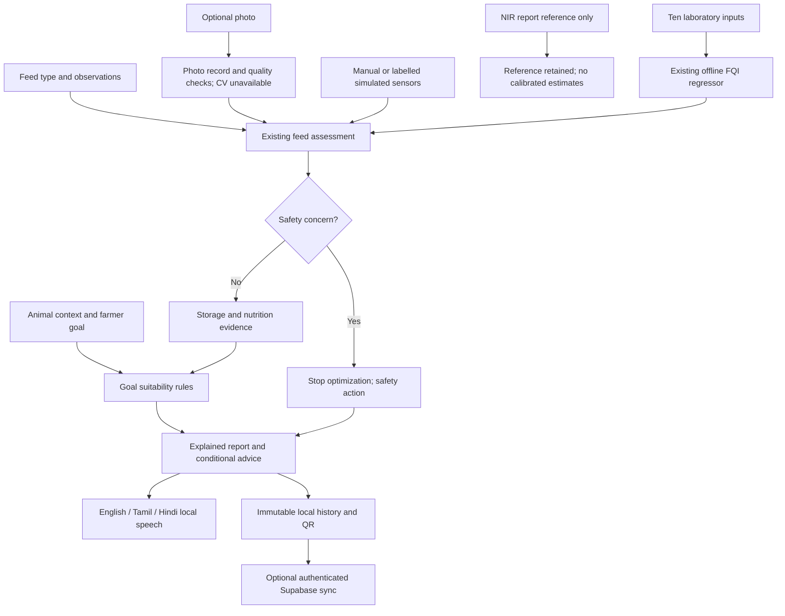

# Goal-Based Feed Intelligence

## Audit and integration

The existing React/Vite wizard, assessment.js screening engine, schemaVersion 2 report, Dexie snapshots, Supabase JSON synchronization, QR, translations, speech controls and original FQI model were reused. No architecture replacement, model retraining, credential changes or cloud migration was needed. Changes are additive: goalProfiles.js defines supported goals and context validation; goals.js evaluates only the existing report. Result comparison does not rerun assess(), image preparation or FQI.

## Profile rules (goal-support-1)

All five profiles have requirements=null. No validated animal requirement dataset was supplied. Therefore this version never issues a numeric goal score, GOOD nutritional suitability, or an adequate complete-ration claim. This is deliberate, not random fallback scoring.

| Priority | Evidence | Decision |
|---|---|---|
| Safety | High safety/overall risk, including reported mould or foreign material | Block all goal optimization, isolate, avoid mixing, confirm |
| Storage | Existing storage/freshness flags | Needs attention; address storage first; no supplement suggestion |
| Information | Missing core feed checks | General guidance; no precision optimization |
| Nutrition | Entered protein/NDF below an explicitly referenced ingredient minimum | Needs attention; conditional ingredient-category advice, no doses |
| Goal | No preceding blocker | General goal support with insufficient evidence to rate nutritional suitability |
| Economics | Profitability selected | Waste-management or avoid-unnecessary-supplement guidance; cost/savings fields remain null |

Milk guidance requires a lactating animal; another category triggers a mismatch explanation. Health guidance is balanced-diet support and referral for illness, not diagnosis. Reproductive guidance concerns nutritional support, not conception guarantees. Profitability never permits using unsafe feed. Missing energy requirements or mineral measurements cannot trigger automatic energy/mineral supplementation.

Body weight 1–2000 kg and milk yield 0–100 L/day are input bounds, not nutritional thresholds. They do not drive ration quantities. Milk yield and stage are ignored outside lactating context. Unknown is supported. Existing prototype feed-screening thresholds remain documented in scoring-and-limitations.md and need expert validation.

## Data and immutability

New schemaVersion 2 reports add animalContext, nirReference and goal. The goal object stores selected, version, null score, qualitative status, priority, findings with sources/references, recommendations, scope and empty economic-result fields. Existing report versions remain readable. A legacy goal is never silently persisted. GoalHistory records actual saved decisions with their timestamp and reading source; changing goals or mixing simulated/manual sources is not evidence of a temporal change in suitability.

The existing Dexie test store accepts the added JSON fields. Supabase feedsight_records.payload retains them without SQL changes. QR includes the recorded goal and suitability. Backup exports already include the entire test snapshot. A goal comparison on a saved report is view-only; its JSON export declares comparisonOnly and savedGoal. Old stored measurements/advice are not rewritten. A new unsaved test can change its goal before its one-time save.

## Specialized pipeline

## Original challenge mapping

| Challenge | Implemented scope |
|---|---|
| Poor-quality feed | Existing explained screening score; nutrient source and missing-data status |
| Adulterated feed | Dedicated adulteration/contamination section; urea, salt, sand untested |
| Fungal contamination | Reported visible observations plus rule-based storage/spoilage risk; image detection explicitly unavailable |
| Toxin presence | Confirmatory testing status; no chemical measurement or concentration |
| Low-quality silage | Existing pH/moisture/storage inputs and optional FQI; unknown fermentation stays unknown |
| Milk production | Conditional nutritional support and animal-category check |
| Animal health | Safety-first, general balanced-diet support |
| Reproductive performance | Nutritional support only; no pregnancy/fertility prediction |
| Profitability | Waste reduction / supplement restraint; no calculated financial return |

## Demo / acceptance

1. Choose a language and start Test my feed.
2. Enter supported feed observations, choose animal context (or unknown), then a goal on step 4.
3. Enter storage data, or explicitly choose Virtual Sensor Simulation. Optional NIR reference does not create measurements.
4. Check feed. Read Feed Health, Goal suitability, the four cards and actions. Unknown nutrient requirements must remain explicit.
5. Change goal and confirm feed measurements, timestamp and FQI do not change.
6. Listen and switch goal/language: active speech stops; the next spoken summary uses the selected goal.
7. Save. Compare another goal and confirm the comparison-only notice. Reload: history and QR retain the saved goal.
8. Repeat offline after initial cache load. Reconnect with the existing account to synchronize.
9. Repeat with reported mould: every goal must stop optimization and suppress supplement advice.

Automated speech uses a mock device API. Live voice availability/pronunciation, expert rule review, multi-device RLS checks, trained CV, calibrated NIR and cost-aware ration optimization remain separate work. The platform is multimodal integration-ready; the unavailable pathways are not represented as working measurements.
